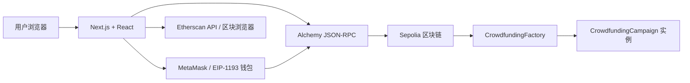
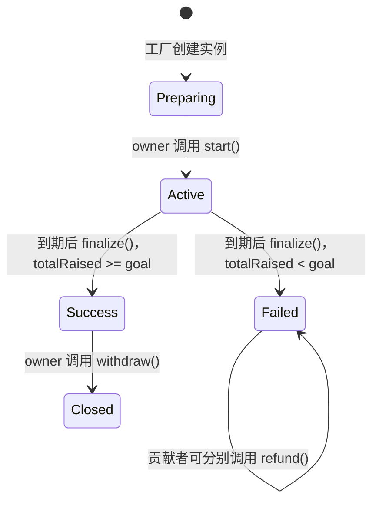
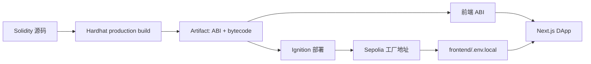
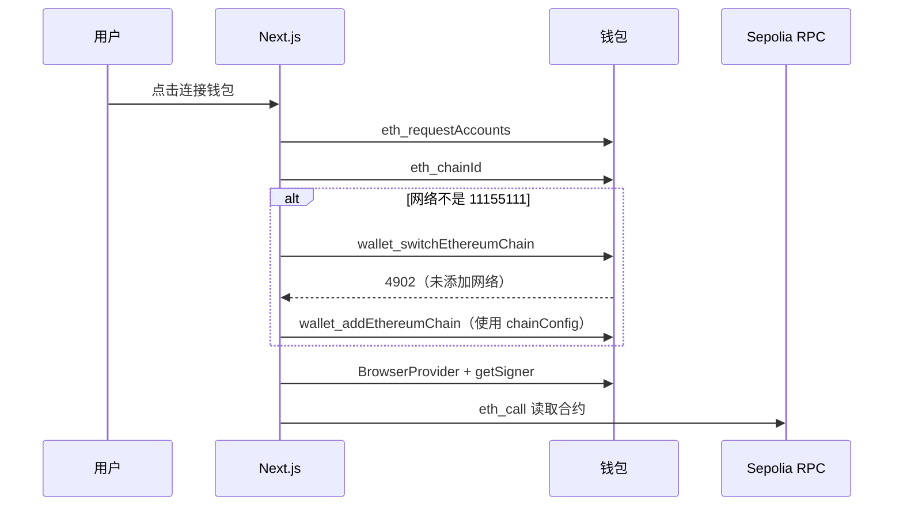
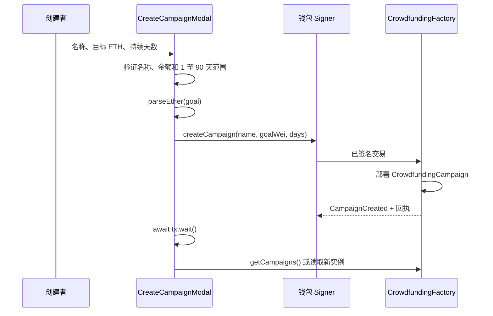

# 众筹 DApp 端到端架构

本文档说明本仓库的众筹应用如何从 Solidity 源码，经 Hardhat 3 编译和部署，交付 ABI 与地址给 Next.js 前端，并由 ethers.js 和用户钱包与 Sepolia 链上合约交互。

适用网络：Sepolia（chain ID `11155111`）。

## 1. 系统边界



各层的职责如下：

| 层 | 目录或服务 | 职责 |
| --- | --- | --- |
| 合约层 | `contracts/` | 定义不可变的资金规则、权限和状态流转。 |
| 构建与测试层 | Hardhat 3、`test/`、`ignition/` | 编译、测试、部署及输出可消费的部署产物。 |
| 区块链层 | Sepolia | 保存合约代码、状态、交易和事件日志。 |
| 钱包层 | MetaMask 等 EIP-1193 钱包 | 管理用户账户及私钥，确认并签名写入交易。 |
| 前端层 | `frontend/` | 展示链上状态、表单校验、发起交易、显示确认结果。 |
| 基础设施层 | Alchemy、Etherscan | RPC 读链/广播交易，以及区块浏览器和账户交易历史。 |

私钥只存在于部署账户或用户钱包中。浏览器中的 `NEXT_PUBLIC_*` 配置、合约地址、ABI 和 RPC URL 都是公开信息，不能存放私钥或助记词。

## 2. 合约模型

### 2.1 工厂合约

`CrowdfundingFactory` 是入口合约，负责创建和索引活动实例：

| 函数或数据 | 用途 | 前端使用场景 |
| --- | --- | --- |
| `createCampaign(name, goal, durationInDays)` | 部署一个新的活动合约，并记录其索引。 | 创建活动，需钱包签名。 |
| `getCampaigns()` | 返回全部活动合约地址。 | 首页活动列表。 |
| `getUserCampaigns(user)` | 返回指定创建者的活动地址。 | 我的创建活动。 |
| `getCampaignCount()` | 返回活动总数。 | 统计或分页。 |
| `CampaignCreated` | 记录创建者、新活动地址、名称、目标与事件字段。 | 交易回执解析、索引服务。 |

每次创建活动均会部署一个独立的 `CrowdfundingCampaign`，该活动的 `owner` 是创建交易的 `msg.sender`。

### 2.2 活动状态机

`CrowdfundingCampaign.State` 的枚举值与前端显示必须一一对应：



| 值 | 状态 | 可调用写操作 |
| ---: | --- | --- |
| `0` | `Preparing` | 仅 owner 可 `start()`。 |
| `1` | `Active` | 截止前任意账户可 `contribute({ value })`；截止后任意账户可 `finalize()`。 |
| `2` | `Success` | 仅 owner 可 `withdraw()`。 |
| `3` | `Failed` | 有贡献记录的账户可 `refund()`。 |
| `4` | `Closed` | 不再有资金操作。 |

金额全部使用 wei 的 `uint256`，前端使用 `ethers.parseEther("0.1")` 将输入的 ETH 转为 wei，使用 `ethers.formatEther(value)` 显示为 ETH。不要用 JavaScript `number` 参与金额计算或比较，以避免超过安全整数范围。

## 3. Hardhat 3 生命周期

### 3.1 配置和密钥

根目录 `.env` 仅供 Hardhat 部署账户使用，示例见 `env.example`：

```dotenv
SEPOLIA_RPC_URL=https://eth-sepolia.g.alchemy.com/v2/YOUR_ALCHEMY_KEY
SEPOLIA_PRIVATE_KEY=0xYOUR_DEPLOYER_PRIVATE_KEY
```

`hardhat.config.ts` 将 `sepolia` 配置为 HTTP 网络，并提供 `production` Solidity profile，其中启用了 optimizer。部署账户应只使用测试 ETH，`.env` 必须被 Git 忽略。

### 3.2 编译、测试和部署

在仓库根目录执行：

```bash
npx hardhat build --build-profile production
npx hardhat test mocha
npx hardhat ignition deploy ignition/modules/Crowdfunding.ts --network sepolia
```

部署模块 `ignition/modules/Crowdfunding.ts` 部署 `CrowdfundingFactory`。部署命令结束后记录以下信息：

- 部署网络与 chain ID。
- `CrowdfundingFactory` 地址。
- 部署交易哈希和 Etherscan 链接。
- 本次提交对应的合约源码版本。
- 所使用的 build profile 和编译器版本。

部署后先确认地址上的确有代码：

```bash
cast code 0xFACTORY_ADDRESS --rpc-url "$SEPOLIA_RPC_URL"
```

返回值不应为 `0x`。若没有安装 Foundry `cast`，可在前端通过 `provider.getCode(factoryAddress)` 做相同检查。

### 3.3 编译产物

编译成功后，前端所需的关键信息在下列产物中：

```text
artifacts/
  contracts/
    CrowdfundingFactory.sol/
      CrowdfundingFactory.json
    CrowdfundingCampaign.sol/
      CrowdfundingCampaign.json
```

每个 `*.json` 包含 ABI、字节码、部署字节码和元数据。浏览器交互只需要 ABI 与合约地址；字节码不应发送到前端。

推荐在每次部署后通过脚本生成前端专用文件，而非手写 ABI：

```text
frontend/src/lib/contracts/
  CrowdfundingFactory.json
  CrowdfundingCampaign.json
  deployments.ts
```

`deployments.ts` 应按链 ID 映射工厂地址，例如：

```ts
export const factoryAddresses = {
  11155111: "0xYourSepoliaFactoryAddress",
} as const;
```

当前项目的 `frontend/src/lib/abis.ts` 是手工维护的 ABI 字符串。这能快速开发，但合约变更后很容易漂移；上线前应改为从上述 Hardhat artifact 提取 ABI。

## 4. ABI 和部署版本契约

合约源码、部署字节码、ABI 与前端调用必须来自同一次构建。它们构成一个不可拆分的接口版本：



当前仓库存在一个必须处理的 ABI 漂移：

- `contracts/CrowdfundingFactory.sol` 的函数名是 `createCampaign`。
- `frontend/src/lib/abis.ts` 目前仍声明 `createCampaigin`。
- `frontend/src/hooks/useFactory.ts` 调用 `createCampaign`。

这会导致 ethers 在运行时找不到匹配的函数。应在部署前将 ABI 改为与当前 Solidity 源码一致，或直接从 artifact 自动生成 ABI。已部署在链上的旧合约不能通过修改前端改变函数名，必须使用该部署对应的 ABI，或重新部署新版本。

另一个语义问题是 `CampaignCreated` 的事件字段命名为 `deadline`，但当前工厂 emit 的值是 `_durationInDays`，不是 `campaign.deadline()` 的 Unix 时间戳。因此前端不能把事件的第 5 个字段直接当截止时间显示；应读取新活动的 `deadline()`，并在下一次合约部署前修正事件值。

## 5. Next.js 与 ethers.js 架构

### 5.1 关键目录

```text
frontend/src/
  app/                         Next.js App Router 页面和全局样式
    page.tsx                   活动列表首页
    campaign/[address]/page.tsx 活动详情和资金操作
  components/
    Web3Provider.tsx           钱包 Provider、账户和 Signer 上下文
    AccountDetailsModal.tsx    余额与 Etherscan 交易历史
  hooks/
    useCampaigns.ts            工厂列表与活动摘要读取
    useCampaign.ts             单活动详情读取
    useFactory.ts              创建活动交易
  lib/
    abis.ts                    当前 ABI 定义，应逐步由 artifact 替代
    chain-config.ts            公共网络、RPC、浏览器和工厂地址配置
```

`Web3Provider` 必须是 Client Component，因为它访问 `window.ethereum`。页面与交互组件通过 `useWeb3()` 得到以下对象：

| 对象 | 来源 | 用途 |
| --- | --- | --- |
| `provider` | `new ethers.BrowserProvider(window.ethereum)` | 从用户钱包连接的网络读取数据。 |
| `signer` | `await provider.getSigner()` | 对状态变更交易签名。 |
| `account` | `eth_accounts` 或 `eth_requestAccounts` | 判断当前用户是否为创建者、是否有退款资格。 |

读取操作是 `eth_call`，不需要签名或 gas；写入操作会创建交易，需要用户在钱包中确认并支付 Sepolia ETH gas。

### 5.2 环境变量

前端在 `frontend/.env.local` 使用以下配置：

```dotenv
NEXT_PUBLIC_FACTORY_ADDRESS=0xYourSepoliaFactoryAddress
NEXT_PUBLIC_CHAIN_ID=11155111
NEXT_PUBLIC_CHAIN_NAME=Sepolia
NEXT_PUBLIC_RPC_URL=https://eth-sepolia.g.alchemy.com/v2/YOUR_ALCHEMY_KEY
NEXT_PUBLIC_BLOCK_EXPLORER_URL=https://sepolia.etherscan.io
NEXT_PUBLIC_ETHERSCAN_API_URL=https://api.etherscan.io/v2/api?chainid=11155111&apikey=YOUR_ETHERSCAN_API_KEY
```

`chain-config.ts` 在浏览器启动时校验前五项必填配置，并派生十六进制 `chainIdHex` 以供 `wallet_switchEthereumChain` 使用。所有变量以 `NEXT_PUBLIC_` 开头，因此会暴露给浏览器：不可放入部署私钥、助记词或任何可签名凭据。

配置变更后必须重启 `pnpm dev` 或重新构建，因为 Next.js 会在构建时内联公开环境变量。

`NEXT_PUBLIC_RPC_URL` 用于钱包尚未添加目标网络时的 `wallet_addEthereumChain` 参数。当前 `useCampaigns.ts` 已创建 `JsonRpcProvider`，但实际列表读取仍要求钱包 `BrowserProvider`；若希望用户未连接钱包也能浏览列表，应将读取 provider 选择为 `provider ?? readOnlyProvider`。

### 5.3 钱包网络切换

连接钱包的目标链 ID 必须与工厂部署网络一致。流程如下：



用户切换账户或链时，应用必须重建 `BrowserProvider`、重新取得 `Signer`，并刷新活动查询。当前 `Web3Provider.tsx` 已监听 `accountsChanged` 和 `chainChanged`；其中 `connectWallet` 仍有一处 `11155111` 硬编码，应改为 `chainConfig.chainId`，使所有网络配置来自同一来源。

## 6. 业务交互路径

### 6.1 读取活动列表

1. 前端根据 `NEXT_PUBLIC_FACTORY_ADDRESS` 创建工厂 `Contract`。
2. 调用 `getCampaigns()` 获得活动地址数组。
3. 对每个活动地址并行调用 `owner`、`name`、`goal`、`deadline`、`totalRaised`、`state`、`getContributorCount`。
4. 将 `bigint` 原值保存在状态中，只在 UI 层使用 `formatEther` 格式化。

活动数较少时可使用 `Promise.all`。当活动规模增长，逐地址 RPC 调用会产生 N+1 请求，建议基于 `CampaignCreated` 事件建设索引服务，例如 The Graph、Subgraph 或服务端数据库缓存。

### 6.2 创建活动



前端应在交易发出后展示 `tx.hash`，在 `await tx.wait()` 后刷新列表。交易被用户拒绝、余额不足、网络错误或合约 `revert` 时，应保留可理解的错误提示，不应假定交易一定成功。

### 6.3 活动生命周期操作

| UI 操作 | ethers 调用 | 交易前检查 |
| --- | --- | --- |
| 启动活动 | `campaign.start()` | 当前账户是 `owner`，状态为 `Preparing`。 |
| 贡献 | `campaign.contribute({ value: parseEther(amount) })` | 已连接账户，状态 `Active`，链上截止时间未到，金额大于零。 |
| 结算 | `campaign.finalize()` | 状态 `Active` 且链上时间已超过 `deadline`。该函数并非仅 owner 可调用。 |
| 提现 | `campaign.withdraw()` | 当前账户是 owner，状态为 `Success`。 |
| 退款 | `campaign.refund()` | 状态为 `Failed`，且 `contributions(account) > 0`。 |

所有写入交易均使用 `Signer` 构造合约：

```ts
const campaign = new ethers.Contract(address, CrowdfundingCampaignABI, signer);
const transaction = await campaign.contribute({
  value: ethers.parseEther("0.1"),
});
await transaction.wait();
```

读取同一个合约时应传入 `Provider`：

```ts
const campaign = new ethers.Contract(address, CrowdfundingCampaignABI, provider);
const [goal, raised] = await Promise.all([
  campaign.goal(),
  campaign.totalRaised(),
]);
```

## 7. 端到端发布清单

### 合约发布前

- 使用 `npx hardhat build --build-profile production` 编译。
- 运行 Solidity 单元测试与 Mocha/ethers 集成测试。
- 覆盖创建、启动、捐款、到期成功结算、失败结算、提现、退款、权限拒绝和重复退款。
- 核对函数名、事件参数、状态枚举与前端 ABI。
- 复核 `finalize()` 的权限策略与产品 UI 是否一致。

### 部署后、前端发布前

- 确认工厂地址位于 Sepolia，且 `getCode(address) !== "0x"`。
- 从同次 build 的 artifact 更新前端 ABI。
- 更新 `NEXT_PUBLIC_FACTORY_ADDRESS`、链 ID、RPC、浏览器和 Etherscan API URL。
- 重启开发服务器，或在部署平台中更新环境变量并重新构建。
- 在 MetaMask 中使用独立 Sepolia 测试账户走完完整流程。
- 检查 Etherscan 上工厂创建事件、子活动地址、贡献、结算和退款交易。

### 生产化建议

- 为 Alchemy 浏览器 Key 设置允许域名、配额和速率限制。
- 使用部署脚本自动导出 ABI 与地址，避免人工复制。
- 通过 CI 依次执行合约编译、合约测试、前端 `pnpm lint` 和 `pnpm build`。
- 为合约部署版本记录 git commit、chain ID、地址、ABI hash 和部署交易哈希。
- 当活动数量上升时用事件索引代替首页的全量链上轮询。
- 在真实主网上线前完成专业安全审计；测试网成功不等于生产环境安全。

## 8. 常用命令

```bash
# 合约：仓库根目录
npx hardhat build --build-profile production
npx hardhat test mocha
npx hardhat ignition deploy ignition/modules/Crowdfunding.ts --network sepolia

# 前端：frontend 目录
pnpm install
pnpm dev
pnpm build
```

前端开发服务器默认监听 `http://localhost:3000`。详情页地址格式为：

```text
http://localhost:3000/campaign/0xYourCampaignAddress
```

该页面地址是子活动 `CrowdfundingCampaign` 的地址，不是工厂 `CrowdfundingFactory` 地址。