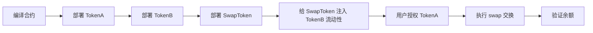

## 在 Remix 中测试 SwapToken 的详细步骤

### 测试流程概览



---

### Step 1：上传并编译合约

1. 打开 [remix.ethereum.org](https://remix.ethereum.org)
2. 在 File Explorer 中创建目录 lession8.1-Invocation，并上传三个文件：
   - `IERC20.sol`
   - `SimpleToken.sol`
   - `SwapToken.sol`
3. 切换到 **Solidity Compiler** 插件，版本选 `0.8.x`
4. 依次编译三个文件（或勾选 Auto compile）

---

### Step 2：部署 TokenA

切换到 **Deploy & Run Transactions** 插件：

| 参数 | 值 |
|---|---|
| Environment | Remix VM (Cancun) |
| Contract | `SimpleToken` |
| `_name` | `"TokenA"` |
| `_symbol` | `"TKA"` |
| `_decimals` | `0`（测试时建议用 0，避免 10^18 的大数） |
| `_totalSupply` | `1000000` |

点击 **Deploy**，复制部署后的地址，记为 `ADDR_TOKEN_A`。

---

### Step 3：部署 TokenB

参数同上，只改名称：

| 参数 | 值 |
|---|---|
| `_name` | `"TokenB"` |
| `_symbol` | `"TKB"` |
| `_decimals` | `0` |
| `_totalSupply` | `1000000` |

部署后记录地址为 `ADDR_TOKEN_B`。

---

### Step 4：部署 SwapToken

| 参数 | 值 |
|---|---|
| Contract | `SwapToken` |
| `_tokenA` | `ADDR_TOKEN_A` |
| `_tokenB` | `ADDR_TOKEN_B` |

部署后记录地址为 `ADDR_SWAP`。

---

### Step 5：给 SwapToken 注入 TokenB 流动性

> SwapToken 合约本身没有 TokenB，需要先充值，否则 swap 时会触发 `InsufficientBalance` 错误。

在 **Deployed Contracts** 中展开 **TokenB** 合约，调用：

```
transfer(ADDR_SWAP, 500000)
```

这样 SwapToken 合约持有 500000 个 TokenB 作为流动性。

---

### Step 6：用户授权 SwapToken 使用 TokenA

展开 **TokenA** 合约，调用：

```
approve(ADDR_SWAP, 10000)
```

> 这一步必须做，否则 `transferFrom` 会因为 allowance 不足而 revert。

---

### Step 7：执行代币交换

展开 **SwapToken** 合约，调用：

```
swap(1000)
```

交换 1000 个 TokenA，按 1:1 比率获得 1000 个 TokenB。

---

### Step 8：验证结果

**查询用户余额**（Account 地址即为当前账户）：

| 操作 | 期望结果 |
|---|---|
| TokenA.`balanceOf(你的地址)` | `999000`（减少了 1000） |
| TokenB.`balanceOf(你的地址)` | `1000`（收到了 1000） |

**查询合约余额**：

```
SwapToken.getContractBalances()
```
| 返回值 | 期望结果 |
|---|---|
| `balanceA` | `1000`（收到用户的 TokenA） |
| `balanceB` | `499000`（500000 - 1000） |

---

### 常见错误排查

| 错误 | 原因 | 解决方法 |
|---|---|---|
| `InsufficientBalance` | SwapToken 没有足够的 TokenB | 先执行 Step 5 注入流动性 |
| `TransferFailed` | 用户没有授权 | 先执行 Step 6 approve |
| `InsufficientAllowance` | approve 的额度不够 | 重新 approve 更大额度 |
| `InvalidAmount` | 传入了 amount=0 | 传入正整数 |


更新了待办事项列表

## `transfer` vs `transferFrom` 参数详解

核心区别：**谁在调用这个函数，谁就是"出钱方"的隐含条件不同。**

---

### `transfer(address to, uint amount)` — 主动转出

```
调用者（msg.sender） ──→ to
```

在 `swap` 函数的 Step 3 中：

```solidity
// 调用方是 SwapToken 合约本身 (address(this))
tokenB.transfer(msg.sender, amountB)
```

| 参数 | 值 | 含义 |
|---|---|---|
| **隐含的 from** | `address(this)` | 因为是 SwapToken 合约在调用 transfer，所以 **TokenB 从合约账户扣款** |
| `to` | `msg.sender` | 用户地址，TokenB **转入用户账户** |
| `amount` | `amountB` | 转账数量 |

---

### `transferFrom(address from, address to, uint amount)` — 代为转出

```
from ──→ to
（需要 from 事先 approve 授权给调用者）
```

在 `swap` 函数的 Step 2 中：

```solidity
// 调用方是 SwapToken 合约，但钱从 msg.sender 扣
tokenA.transferFrom(msg.sender, address(this), amountA)
```

| 参数 | 值 | 含义 |
|---|---|---|
| `from` | `msg.sender` | 用户地址，TokenA **从用户账户扣款** |
| `to` | `address(this)` | SwapToken 合约地址，TokenA **转入合约账户** |
| `amount` | `amountA` | 转账数量 |
| **前提条件** | — | 用户必须提前调用 `tokenA.approve(ADDR_SWAP, amount)`，否则 revert |

---

### 整体资金流动图

```
用户账户 (msg.sender)               SwapToken 合约 (address(this))
│                                   │
│  ── tokenA.transferFrom ──────→   │  amountA 个 TokenA 流入合约
│                                   │
│  ←── tokenB.transfer ──────────   │  amountB 个 TokenB 流出合约
│                                   │
```

---

### 为什么 Step 2 不能用 `transfer` 而必须用 `transferFrom`？

因为 `transfer` 只能让**调用者自己**转出自己的钱。

在 `swap` 函数中，调用者是 **SwapToken 合约**，它没有 TokenA，无法用 `transfer` 从用户账户扣款。

`transferFrom` 的设计就是为了**第三方代为划转**：用户先 `approve` 授权，合约再用 `transferFrom` 代扣，这是 ERC20 标准的两步操作模式。