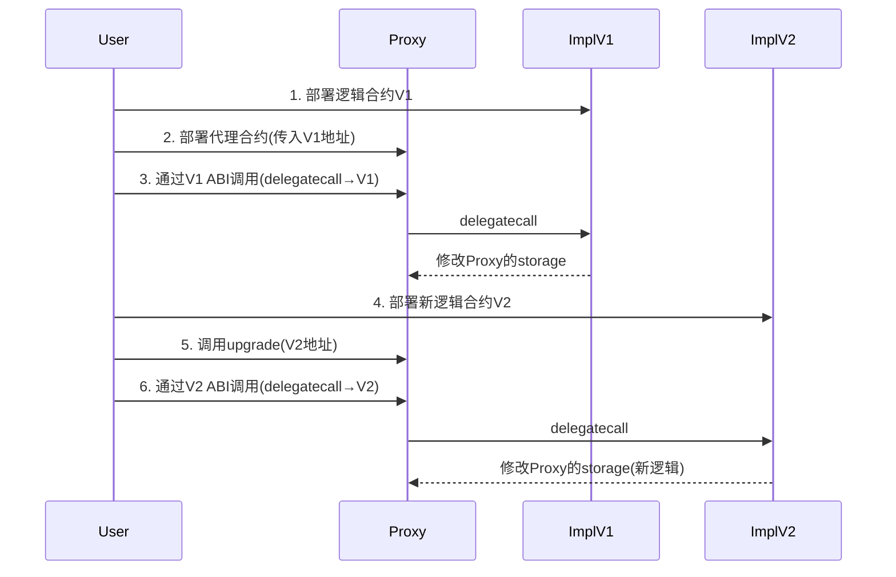
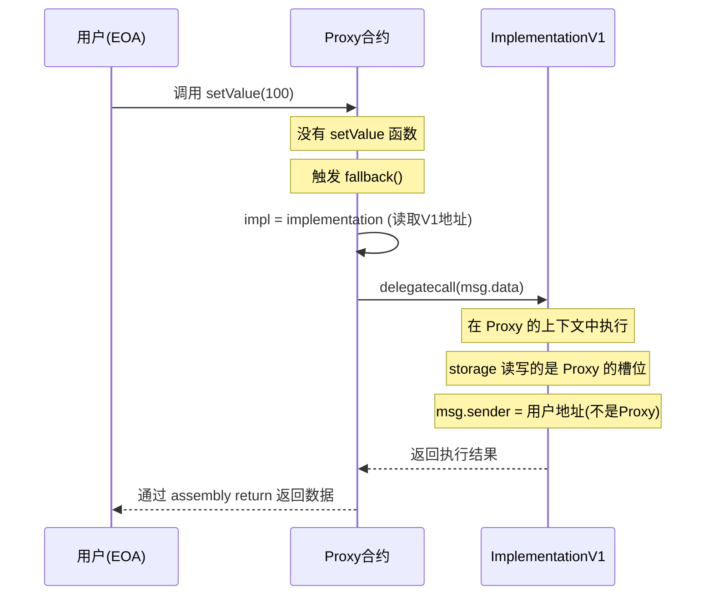

更新了待办事项列表

## Remix 部署测试详细步骤

### 前置准备：理解存储布局

在开始之前，先分析三个合约的存储槽位分配：

**Proxy.sol 存储槽：**
| 槽位 | 变量 | 类型 |
|------|------|------|
| slot 0 | `implementation` | address |
| slot 1 | `value` | uint |
| slot 2 | `owner` | address |

**ImplementationV1/V2 存储槽：**
| 槽位 | 变量 | 类型 |
|------|------|------|
| slot 0 | `value` | uint |
| slot 1 | `owner` | address |

> ⚠️ **重要警告**：当前三个合约存在**存储槽碰撞（Storage Collision）**问题！详见文末分析。

---

## 一、Remix 部署测试步骤

### Step 1：创建并编译合约

1. 打开 [Remix IDE](https://remix.ethereum.org)
2. 在 `contracts/` 目录下新建三个文件，粘贴对应代码
3. 在 **Solidity Compiler** 面板中，选择编译器版本 `^0.8.0`，依次编译三个文件

### Step 2：部署 ImplementationV1

1. 切换到 **Deploy & Run Transactions** 面板
2. Environment 选择 `Remix VM (Shanghai)`（本地测试环境）
3. Contract 下拉选择 `ImplementationV1`
4. 点击 **Deploy**
5. 复制部署后的合约地址（例如 `0xABC...`）

### Step 3：部署 Proxy

1. Contract 下拉选择 `Proxy`
2. 在 Deploy 旁边的输入框中填入 `ImplementationV1` 的地址
3. 点击 **Deploy**
4. 记录 Proxy 合约地址（例如 `0xDEF...`）

### Step 4：通过 Proxy 调用 V1 逻辑（关键步骤）

代理合约本身没有 `setValue/getValue`，需要借助 ABI 来调用：

1. Contract 下拉切换到 `ImplementationV1`
2. 在 **At Address** 输入框中填入 **Proxy 的地址**（不是 V1 的地址！）
3. 点击 **At Address** 按钮，Remix 会在 Proxy 地址上加载 V1 的 ABI

```
此时操作的是 Proxy 合约，但使用的是 ImplementationV1 的接口
```

4. 调用 `setValue(100)`
5. 调用 `getValue()`，验证返回值

### Step 5：验证 delegatecall 的上下文特性

在 Proxy 合约面板中直接查看：
- `value` → 应该等于 `setValue` 设置的值（存储在 Proxy 中）
- `owner` → 应该是你当前的钱包地址（`msg.sender` 是原始调用者）

同时查看 ImplementationV1 合约面板：
- `value` → 应该是 `0`（V1 自身的存储未被修改）

这验证了 **delegatecall 修改的是代理合约的 storage，而非逻辑合约的**。

### Step 6：部署 ImplementationV2

1. Contract 选择 `ImplementationV2`
2. 点击 **Deploy**，记录 V2 地址

### Step 7：执行升级

1. 在 Proxy 合约面板中调用 `upgrade(V2地址)`
2. 验证 `implementation` 字段已变为 V2 地址

### Step 8：验证 V2 新逻辑

1. Contract 下拉切换到 `ImplementationV2`
2. 在 **At Address** 输入 **Proxy 地址**，加载 V2 接口
3. 调用 `setValue(10)`
4. 调用 `getValue()` → 返回 `20`（值翻倍，新逻辑生效）
5. 调用 `reset()` → value 归零（V1 没有此函数，升级后才有）

---

## 二、代理合约逻辑升级常规步骤



### 升级核心原则

| 原则 | 说明 |
|------|------|
| **存储在 Proxy** | 所有状态数据始终存储在代理合约 |
| **逻辑在 Implementation** | 业务逻辑可随时替换 |
| **存储布局只增不改** | V2 只能在 V1 末尾新增变量，绝不能修改已有槽位顺序 |
| **权限控制** | `upgrade()` 必须有 `onlyOwner` 类限制 |

---

## 三、当前代码的存储碰撞问题 ⚠️

这是代码中一个需要注意的**真实 Bug**：

**问题根源**：Proxy 在 slot 0 存储了 `implementation`，而 Implementation 合约的 slot 0 是 `value`。

```
delegatecall 执行 value = _value 时:
  写入的是 Proxy 的 slot 0 → 即 implementation 地址被覆盖！
  
delegatecall 执行 owner = msg.sender 时:  
  写入的是 Proxy 的 slot 1 → 即 value 被覆盖！
```

**修复方案（EIP-1967 标准）**：将 `implementation` 存储在特定哈希槽位，避免与业务变量冲突：

```solidity
// EIP-1967: 使用固定的存储槽存放 implementation 地址
bytes32 private constant IMPLEMENTATION_SLOT = 
    keccak256("eip1967.proxy.implementation") - 1;
// = 0x360894a13ba1a3210667c828492db98dca3e2076cc3735a920a3ca505d382bbc
```

这也是 OpenZeppelin 的 `TransparentUpgradeableProxy` 和 `UUPS` 所采用的核心机制。


更新了待办事项列表

## 代理合约调用逻辑合约执行流程分析

### 一、整体调用链



---

### 二、fallback 函数逐行解析

```solidity
fallback() external payable {
    // ① 读取当前逻辑合约地址
    address impl = implementation;
    
    // ② 安全检查
    require(impl != address(0), "Implementation not set!");

    // ③ 核心：delegatecall
    (bool success, bytes memory returnData) = impl.delegatecall(msg.data);
    //  msg.data = 函数选择器(4字节) + 编码参数
    //  例如 setValue(100) → 0x55241077 + 0x0000...0064

    // ④ 失败处理：原样透传错误
    if (!success) {
        assembly {
            returndatacopy(0, 0, returndatasize())
            revert(0, returndatasize())
        }
    }

    // ⑤ 成功：原样返回数据
    assembly {
        return(add(returnData, 0x20), mload(returnData))
    }
}
```

---

### 三、call vs delegatecall 对比

| 对比项 | `call` | `delegatecall` |
|--------|--------|----------------|
| **代码执行位置** | 目标合约自身 | 调用者合约上下文 |
| **storage 读写** | 目标合约的存储 | **调用者合约的存储** |
| **`msg.sender`** | 调用者合约地址 | **原始用户地址** |
| **`msg.value`** | 调用者合约地址 | 原始用户发送的 ETH |
| **`address(this)`** | 目标合约地址 | **调用者合约地址** |

---

### 四、存储槽写入过程（修复后）

以调用 `setValue(100)` 为例，delegatecall 在 **Proxy 的存储空间**中执行 V1 的代码：

```
Proxy 的存储空间:
┌─────────┬──────────────────────┬────────────────────────────┐
│  槽位   │      执行前           │          执行后             │
├─────────┼──────────────────────┼────────────────────────────┤
│ slot 0  │ 0xV1合约地址          │ 0xV1合约地址 (不变)         │
│ slot 1  │ 0                    │ 100  ← value = _value      │
│ slot 2  │ 0x部署者地址          │ 0x用户地址 ← owner = sender│
└─────────┴──────────────────────┴────────────────────────────┘

ImplementationV1 自身的存储空间: 全部保持 0，完全不受影响
```

---

### 五、升级切换后的流程变化

调用 `upgrade(V2地址)` 后，只有 `implementation` 指针改变，**storage 数据完整保留**：

```
升级前 Proxy storage:          升级后 Proxy storage:
slot 0: 0xV1地址               slot 0: 0xV2地址  ← 只改了这里
slot 1: 100                    slot 1: 100       ← 数据保留
slot 2: 0x用户地址              slot 2: 0x用户地址 ← 数据保留

再次调用 setValue(10):
→ fallback → delegatecall → 现在执行 V2 的代码
→ value = _value * 2 = 20   ← 新逻辑生效，但操作的还是 Proxy 的 slot 1
```

---

### 六、关键设计思想总结

```
代理模式 = 数据与逻辑分离

Proxy 合约          Implementation 合约
┌────────────┐      ┌────────────────────┐
│  storage   │      │  code (逻辑)        │
│  (永久)    │  ←── │  无状态，可随时替换  │
│  数据不变  │ delegatecall │              │
└────────────┘      └────────────────────┘
```

- **Proxy**：只负责存数据，永远不升级
- **Implementation**：只负责写逻辑，随时可换新版本
- **delegatecall**：桥梁，让新代码操作旧数据

更新了待办事项列表

## 合约升级能力必须在最初设计时决定

你的理解是正确的，这是 Solidity 开发中一个非常重要的架构决策。

---

### 一、为什么必须从一开始就用代理模式

**智能合约一旦部署，代码永远不可更改**（区块链的核心特性）。

```
普通合约部署后：
┌─────────────────────────┐
│  用户地址 0xABC          │
│         ↓               │
│  合约地址 0xDEF (死的)   │  ← 代码永远固定，无法修改
└─────────────────────────┘

代理模式部署后：
┌──────────────────────────────────────────┐
│  用户地址 0xABC                           │
│         ↓                                │
│  Proxy 地址 0xDEF (永久不变，用户记住它) │
│         ↓ delegatecall                   │
│  Logic V1 → Logic V2 → Logic V3 ...     │  ← 逻辑可以换
└──────────────────────────────────────────┘
```

代理模式的核心价值：**用户始终与同一个地址交互，但背后的逻辑可以替换**。

---

### 二、老合约不能"追加"升级能力

对于已部署的非代理合约，**无法直接追加升级能力**，原因有两个：

#### 问题1：代码不可变
```
已部署的老合约 0xOLD:
  - 没有 upgrade() 函数
  - 没有 fallback delegatecall
  - 无法修改，永远如此
```

#### 问题2：状态被锁定在老合约中
```
老合约 0xOLD:
  storage slot 0: userBalance[Alice] = 1000  ┐
  storage slot 1: userBalance[Bob]   = 500   ├─ 这些数据被锁在这个地址里
  storage slot 2: totalSupply        = 9999  ┘

新代理合约 0xNEW:
  storage: 全部为 0  ← 全新的存储，老数据取不过来
```

---

### 三、老合约能做的"补救"方案

虽然无法真正升级，但有几种有限的补救手段：

#### 方案A：迁移 + 新系统（最常见）
```
老合约 0xOLD (继续运行)
         ↓ 用户主动迁移资产
新代理合约 0xNEW (全新代理架构)
```
- 需要用户**主动操作**把资产迁移过去
- 典型案例：很多 DeFi 项目的 V1 → V2 迁移
- 缺点：迁移成本高，用户可能不配合

#### 方案B：包装合约（Wrapper）
```
用户 → WrapperContract → 老合约 0xOLD
```
- 在老合约外面套一层新合约，拦截部分调用
- 只能**扩展功能**，无法修改老合约已有的逻辑
- 局限性很大

#### 方案C：老合约预留了迁移钩子
```solidity
// 老合约如果有这类函数就能迁移
function migrate(address newContract) external onlyOwner {
    INewContract(newContract).importState(balances);
}
```
- 前提是老合约开发时就预留了这类接口
- 大多数老合约没有

---

### 四、实践中的架构决策建议

```
项目会上线主网且可能需要修 Bug / 升级功能？
        ↓
   YES → 从第一天就用代理模式
         推荐方案：
         - OpenZeppelin TransparentProxy（多数项目）
         - UUPS（更省 Gas，更现代）
         
   NO  → 普通合约（更简单，完全去中心化，用户更信任）
         适合：纯算法合约、不可变的金融协议
```

**总结一句话**：代理模式是一种**预先设计好的能力**，不是事后可以追加的补丁。老合约没有用代理模式，就只能接受它的不可变性，或者通过迁移的方式构建全新的可升级系统。


更新了待办事项列表

## Proxy fallback 函数详解

### 一、fallback 的作用

```solidity
fallback() external payable { ... }
```

**触发条件**：当调用的函数在 Proxy 中不存在时自动触发。这是代理模式的核心机制——所有未知调用都被拦截并转发。

```
proxy.setValue(100)   → Proxy 没有此函数 → 触发 fallback → 转发给 Implementation
proxy.getValue()      → Proxy 没有此函数 → 触发 fallback → 转发给 Implementation
proxy.upgrade(addr)   → Proxy 有此函数  → 直接执行，不走 fallback
proxy.owner()         → Proxy 有此函数  → 直接执行，不走 fallback
```

---

### 二、逐行解析

```solidity
fallback() external payable {

    // ① 读取逻辑合约地址到栈变量
    // 为什么不直接用 implementation？
    // 因为 assembly 中无法直接访问 Solidity 变量名，
    // 先读到局部变量，后续 assembly 可以引用
    address impl = implementation;

    // ② 安全检查：防止指向零地址
    require(impl != address(0), "Implementation not set!");

    // ③ 核心：delegatecall 转发
    // msg.data = 完整的调用数据（函数选择器 + 参数编码）
    // 原样传给逻辑合约，逻辑合约以为自己被直接调用
    (bool success, bytes memory returnData) = impl.delegatecall(msg.data);

    // ④ 失败处理：使用 assembly 原样透传错误信息
    if (!success) {
        assembly {
            // returndatacopy(destOffset, srcOffset, size)
            // 把底层调用返回的原始错误数据复制到内存位置 0
            returndatacopy(0, 0, returndatasize())
            // 从内存位置 0 读取 returndatasize() 字节作为错误信息回滚
            revert(0, returndatasize())
        }
    }

    // ⑤ 成功：使用 assembly 原样返回数据
    assembly {
        // returnData 是 bytes 类型，内存布局：
        // [前32字节: 数组长度][后N字节: 实际数据]
        // add(returnData, 0x20) 跳过长度字段，指向实际数据起始位置
        // mload(returnData) 读取前32字节即数组长度
        return(add(returnData, 0x20), mload(returnData))
    }
}
```

---

### 三、为什么用 assembly 而不直接 return？

```solidity
// ❌ 普通写法：无法编译，fallback 不支持返回值声明
fallback() external payable returns (bytes memory) { ... }

// ❌ 即使能写，这样也会多一次 ABI 编码，破坏原始数据
return returnData;

// ✅ assembly return：直接操作内存，零损耗地原样透传数据
assembly {
    return(add(returnData, 0x20), mload(returnData))
}
```

---

### 四、这种写法是固定的吗？

**基本结构是固定的**，但有不同的实现变体：

| 版本 | 特点 |
|------|------|
| **当前写法**（Solidity 方式） | 可读性好，适合教学，有轻微 Gas 开销 |
| **纯 assembly 写法**（生产级） | 最省 Gas，OpenZeppelin 使用此方案 |
| **UUPS 写法** | 升级逻辑放在逻辑合约而非代理合约 |

**生产级纯 assembly 写法**（OpenZeppelin TransparentProxy 的核心）：

```solidity
fallback() external payable {
    assembly {
        // 直接从 slot 0 读取 implementation 地址
        let impl := sload(0)
        // 把调用数据复制到内存位置 0
        calldatacopy(0, 0, calldatasize())
        // delegatecall(gas, addr, argsOffset, argsLen, retOffset, retLen)
        let result := delegatecall(gas(), impl, 0, calldatasize(), 0, 0)
        // 把返回数据复制到内存
        returndatacopy(0, 0, returndatasize())
        // 根据结果决定 return 还是 revert
        switch result
        case 0  { revert(0, returndatasize()) }
        default { return(0, returndatasize())  }
    }
}
```

---

### 五、当前写法的一个隐患

`payable` 修饰符要注意：

```
fallback() external payable
```

这意味着向 Proxy 发送 ETH 同时附带调用数据时会走 fallback，但**纯转账（无 calldata）**走的是 `receive()`。两者都要有才能完整处理 ETH。当前合约已经有 `receive()`，这点是正确的。