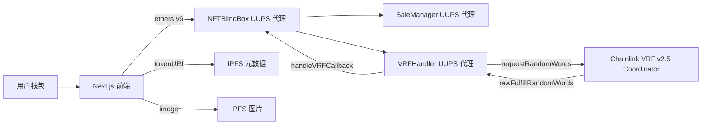
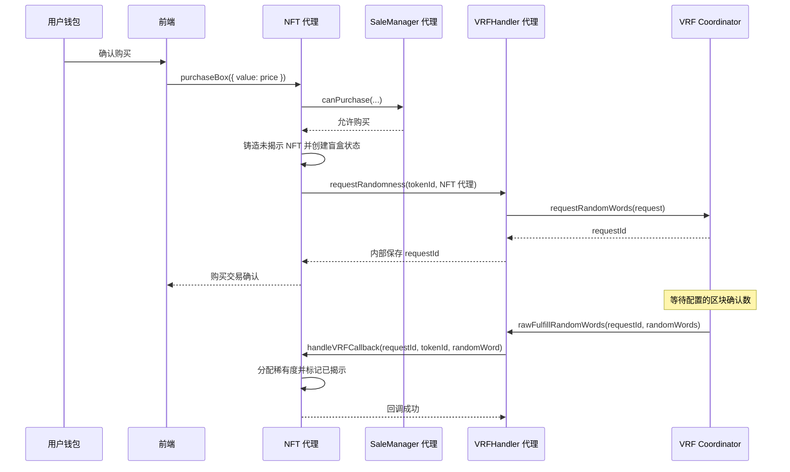
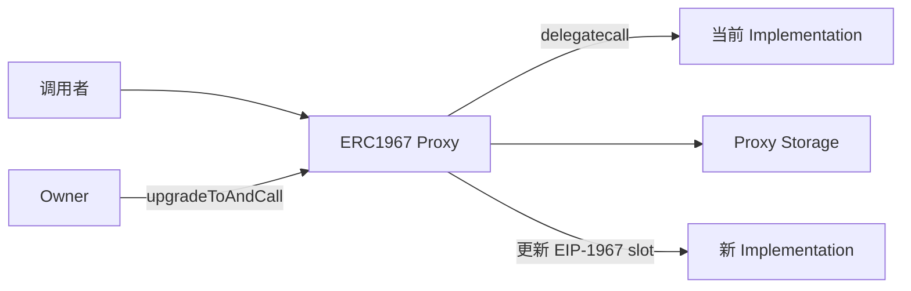

# NFT 盲盒技术架构

## 1. 文档范围

本文档描述当前 NFT 盲盒系统从浏览器到以太坊网络的完整技术链路：

- Next.js 前端与钱包交互
- 使用 UUPS 代理的 NFT、销售和 VRF 合约
- Chainlink VRF v2.5 随机数请求与回调
- IPFS 元数据和图片展示
- 部署、权限管理与升级操作

系统支持 Sepolia 测试网和以太坊主网。以下命令均以 Sepolia 为例。

## 2. 系统架构图



每个盲盒 NFT 都由 NFT 主合约代理铸造。销售规则和 VRF 集成是独立的 UUPS 模块；升级实现合约时，它们的代理地址不会改变。

## 3. 合约职责

| 组件 | 是否使用代理 | 主要职责 | 权限 owner |
| --- | --- | --- | --- |
| `NFTBlindBoxUpgradeable` | 是 | ERC-721 铸造、盲盒状态、揭示、token URI、提取资金、模块地址引用 | 主 NFT owner |
| `SaleManager` | 是 | 价格、销售状态和阶段、白名单、每钱包购买上限 | 销售模块 owner |
| `VRFHandler` / `VRFHandlerV3` | 是 | VRF 请求记录、Coordinator 回调、随机数转发 | VRF 模块 owner |
| Chainlink VRF Coordinator | 否 | 生成并验证随机数 | Chainlink |

NFT 主合约保存的是 `SaleManager` 和 `VRFHandler` 的**代理地址**，而非 implementation 地址。Chainlink Subscription 中注册的 consumer 也必须是稳定不变的 `VRFHandler` **代理地址**。

### NFT 状态与揭示

`NFTBlindBoxUpgradeable.purchaseBox()` 会在一笔交易中完成以下操作：

1. 调用 `saleManager.canPurchase(buyer, balance, msg.value)` 校验购买资格。
2. 分配 `tokenId = totalSupply`，然后递增 `totalSupply`。
3. 向购买者铸造 ERC-721 NFT。
4. 创建未揭示状态的 `BlindBoxStorage.BlindBox` 记录。
5. 调用 `vrfHandler.requestRandomness(tokenId, address(this))` 请求随机数。
6. 发出 `BoxPurchased` 事件。

第一个 NFT 的 `tokenId` 是 `0`，这是合法值，不能用它判断请求是否存在。

当 VRF 回调完成时，`handleVRFCallback()` 仅允许配置的 VRF Handler 代理调用。主合约通过 `RarityLibrary.assignRarity` 将随机数转换为稀有度，保存稀有度，标记盲盒已揭示，并发出 `RarityAssigned` 与 `BoxRevealed` 事件。

### 销售模块

`SaleManager` 管理三个销售阶段：

| 阶段 | 含义 |
| --- | --- |
| `NotStarted` | 禁止购买 |
| `Whitelist` | 用户须在白名单内，且不超过 `whitelistMaxMint` |
| `Public` | 所有用户均可购买，但仍受价格和 `maxPerWallet` 限制 |

模块会校验支付金额、钱包持有数量，以及白名单阶段下的资格和额度。价格和销售阶段均由模块 owner 管理。

### VRF 模块

`VRFHandler` 使用 `VRFV2PlusClient.RandomWordsRequest` 向 Chainlink VRF v2.5 Coordinator 请求随机数。每个请求会保存：

```text
requestId -> tokenId
requestId -> NFT 回调合约地址
```

支付方式由 `*_VRF_NATIVE_PAYMENT` 配置：

- `true`：使用原生代币，例如 Sepolia ETH。
- `false`：使用 LINK。

生产环境的回调实现为 `VRFHandlerV3`。Chainlink 使用下列标准入口调用 consumer：

```solidity
rawFulfillRandomWords(uint256 requestId, uint256[] randomWords)
```

`VRFHandlerV3.rawFulfillRandomWords()` 会确认调用者是已配置的 Coordinator，读取待处理请求，调用 `NFTBlindBoxUpgradeable.handleVRFCallback()`，最后清除请求映射。它通过已保存的 callback 地址判断请求是否存在，而不是通过 `tokenId != 0` 判断。

## 4. 购买与揭示时序



Chainlink 回调是异步过程。购买交易成功只代表随机数请求已提交，不表示 NFT 已经揭示。

## 5. 元数据与图片展示

`tokenURI(tokenId)` 按需计算，不为每个 token 在链上存储完整 URI：

- 未揭示：`<baseURI>/blindbox.json`
- 已揭示：`<baseURI>/<Common|Rare|Epic|Legendary>.json`

当前同一种稀有度的 NFT 共用同一份 metadata 和图片。这是既定设计，已揭示路径中不包含 `tokenId`。

前端会读取每个 NFT 的 `getBlindBoxStatus()` 和 `tokenURI()`：

1. `revealed` 为 `false` 时，`BlindBoxCard` 显示带锁的动态盲盒，不请求 metadata，也不显示图片。
2. `revealed` 为 `true` 时，`BlindBoxCard` 请求 `/api/ipfs?path=<CID/path>`。
3. Next.js 路由 `app/api/ipfs/route.ts` 会校验 IPFS 路径，并在服务端请求配置的网关。
4. 前端读取 `metadata.image`，将 `ipfs://CID/...` 转换为 `NEXT_PUBLIC_IPFS_GATEWAY/CID/...`，并渲染图片。

同源 metadata 路由避免了浏览器直接请求公共 IPFS 网关时可能出现的 CORS 或重定向失败。`MyNFTs` 在用户仍有未揭示盲盒时定时刷新，因此 VRF 回调完成后，页面会自动切换为已揭示图片。

新部署时，`NFT_BASE_URI` 应不带末尾 `/`，因为 `MetadataLibrary` 自行添加路径分隔符。已部署地址产生的双斜杠路径当前可被配置的网关兼容，但不应依赖这一行为。

## 6. UUPS 可升级设计

### 代理模型

每个可变的业务组件均使用 ERC-1967 Proxy 与 UUPS implementation：



状态数据属于代理合约。升级 implementation 只替换可执行逻辑，必须保证存储布局兼容。

### 升级授权

每个 UUPS implementation 均应：

- 继承 `Initializable`、`OwnableUpgradeable` 和 `UUPSUpgradeable`。
- 在 constructor 中以 `_disableInitializers()` 禁止直接初始化 implementation。
- 仅通过部署代理时的 `initialize(...)` 初始化 owner 与状态。
- 实现 `_authorizeUpgrade(address) internal override onlyOwner`。

仅继承 `OwnableUpgradeable` 并不会让合约具备升级能力；还必须继承 UUPS 并实现升级授权函数。

### 存储兼容性规则

生产环境升级前必须遵循：

1. 不得重排、删除或修改已有状态变量的类型。
2. 新状态变量只能添加在已有变量之后。
3. 不得改变继承顺序。
4. 必须保留 storage gap，或以受控方式使用它。
5. constructor 中不能初始化代理状态。
6. 需要从当前已部署 implementation 升级，并用真实的待处理 VRF 请求进行测试。

VRF V2/V3 的修改与 V1 存储兼容，因为它们复用了 V1 的映射，并保留了原有变量顺序。

## 7. 环境变量配置

复制 `env.example` 为 `.env`。不要提交 `.env`、RPC 凭据或私钥。

主要配置如下：

```env
SEPOLIA_RPC_URL=https://...
SEPOLIA_PRIVATE_KEY=0x...
MODULE_OWNER_ADDRESS=0x...              # 生产环境使用多签地址
SALE_PRICE=0.008
SALE_MAX_PER_WALLET=100
NFT_NAME=Mystery NFT
NFT_SYMBOL=MNFT
NFT_MAX_SUPPLY=10000
NFT_BASE_URI=ipfs://<metadata-root-cid>

SEPOLIA_VRF_COORDINATOR=0x...
SEPOLIA_KEY_HASH=0x...
SEPOLIA_SUBSCRIPTION_ID=<uint256>
SEPOLIA_CALLBACK_GAS_LIMIT=2500000
SEPOLIA_REQUEST_CONFIRMATIONS=3
SEPOLIA_VRF_NATIVE_PAYMENT=true
```

部署完成后写入：

```env
SALE_MANAGER_ADDRESS=0x<sale-manager-proxy>
VRF_HANDLER_ADDRESS=0x<vrf-handler-proxy>
PROXY_ADDRESS=0x<nft-proxy>
```

前端的 `frontend/.env.local` 使用 NFT **代理**地址和 IPFS 网关：

```env
NEXT_PUBLIC_DEFAULT_NETWORK=sepolia
NEXT_PUBLIC_RPC_URL=https://...
NEXT_PUBLIC_CONTRACT_ADDRESS_SEPOLIA=0x<nft-proxy>
NEXT_PUBLIC_IPFS_GATEWAY=https://gateway.pinata.cloud/ipfs/
```

修改任意 `NEXT_PUBLIC_*` 变量后必须重启 Next.js 服务。

## 8. 部署流程

### 前置条件

1. 给部署账户准备足够的原生代币作为 gas。
2. 在目标网络创建 Chainlink VRF v2.5 Subscription。
3. 根据支付方式为 Subscription 充值：`*_VRF_NATIVE_PAYMENT=true` 时充值原生代币，否则充值 LINK。
4. 配置完所有环境变量。
5. 编译并执行集成测试：

```bash
npx hardhat build
npx hardhat test mocha
```

### 部署模块

```bash
npx hardhat run scripts/deployModules.ts --network sepolia
```

将输出的 `SaleManager proxy` 和 `VRFHandler proxy` 写入 `.env`。

> 重要：当前 `deployModules.ts` 默认部署的是 `VRFHandler` V1 implementation，不包含 Chainlink 所需的 `rawFulfillRandomWords` 标准入口。新部署后必须先升级到 V3，才能添加 consumer 并开启销售。

升级新部署的 VRF Proxy：

```bash
npx hardhat run scripts/upgradeVRFHandler.ts --network sepolia
```

签名账户必须是 VRF 模块 owner。若 `MODULE_OWNER_ADDRESS` 是多签地址，应通过多签提交升级交易，而不是直接使用个人部署私钥。

### 注册 VRF Consumer

在 Chainlink VRF Subscription 控制台中，将 `VRF_HANDLER_ADDRESS` 的**代理地址**添加为 consumer，不要添加 implementation 地址。确认 Subscription 余额充足，且支付模式与配置一致。

### 部署 NFT 主合约代理

```bash
npx hardhat run scripts/deployWithUUPS.ts --network sepolia
```

将输出的 `Proxy Address` 写入 `PROXY_ADDRESS` 和 `NEXT_PUBLIC_CONTRACT_ADDRESS_SEPOLIA`。

### 启用销售并验收

使用销售脚本设置阶段：

```bash
PHASE=public npx hardhat run scripts/enableSale.ts --network sepolia
```

上线前完成一次测试购买，并确认：

1. NFT 主合约发出 `BoxPurchased`。
2. Chainlink Subscription 中出现 VRF 请求。
3. Coordinator 向 VRF Handler 代理调用 `rawFulfillRandomWords`。
4. NFT 主合约发出 `RarityAssigned` 与 `BoxRevealed`。
5. `tokenURI()` 从 `blindbox.json` 切换为对应稀有度 JSON。
6. 前端从带锁盲盒卡片切换为已揭示图片。

## 9. 升级流程

### 通用检查清单

1. 暂停公售，或评估进行中的 VRF 请求受升级影响的程度。
2. 检查存储布局，确认向后兼容。
3. 编译、检查相关脚本类型，并执行升级测试。
4. 只部署新的 implementation，不要部署新的 proxy。
5. 通过组件 owner 执行 `upgradeToAndCall(newImplementation, data)`。
6. 读取 EIP-1967 implementation slot，确认 proxy 已指向新 implementation。
7. 使用不变的 proxy 地址重新验证关键业务功能。

VRF Handler 的现有脚本会校验 owner、部署 `VRFHandlerV3`、执行 `upgradeToAndCall` 并验证 implementation slot：

```bash
npx hardhat run scripts/upgradeVRFHandler.ts --network sepolia
```

由于 proxy 地址未改变，Chainlink Subscription consumer 无须变更。待处理请求保存在 proxy storage 中，V3 能兼容处理它们。

### NFT 主合约与 SaleManager 升级

NFT 主合约和 SaleManager 使用相同的 UUPS 模式，但升级时必须针对对应 proxy 地址，并确认新 implementation 的 ABI、owner、存储布局与升级后冒烟测试。不能在未验证这些条件时套用通用升级脚本。

## 10. 前端与合约交互

`useNFTBlindBox` 使用连接钱包的 provider 创建 ethers v6 合约实例：

- 读操作使用 provider：销售信息、供应量、余额、所有权、盲盒状态和 URI。
- `purchaseBox` 使用 signer，并传递 `value: saleInfo.price`。
- 购买后 hook 会刷新数据；`MyNFTs` 在用户持有未揭示盲盒时继续轮询。

前端应拒绝或引导用户切换到不支持的网络。合约地址由 chain ID 对应的环境变量配置选择，前端地址必须始终填写 NFT 主合约的 proxy 地址。

## 11. 运维与安全注意事项

- 生产环境应将部署者与 owner 分离，并将模块 ownership 交给多签。
- 私钥不得进入源码管理；任何泄露过的私钥都应立即轮换。
- 监控 VRF Subscription 余额；余额不足会使盲盒长期无法揭示。
- 监控 `RandomnessRequested`、`RandomnessFulfilled`、`RarityAssigned` 和 `BoxRevealed` 事件。
- callback gas limit 是生产容量参数，应在测量完整回调链路后再调整。
- 升级逻辑时不要替换 NFT 合约或 Chainlink Subscription 中的 proxy 地址，应在稳定地址背后升级 implementation。
- `setVRFHandler` 与 `setSaleManager` 会重定向核心业务逻辑，只应在明确的迁移操作中调用。
- 新部署前，应将 `deployModules.ts` 改为直接部署 `VRFHandlerV3`，或严格保留本文档规定的 V3 升级步骤。

## 12. 关键文件

| 区域 | 文件 |
| --- | --- |
| NFT 主合约 | `contracts/NFTBlindBoxUpgradeable.sol` |
| 销售模块 | `contracts/modules/SaleManager.sol` |
| VRF V1 存储与请求逻辑 | `contracts/handlers/VRFHandler.sol` |
| 生产 VRF 回调逻辑 | `contracts/handlers/VRFHandlerV3.sol` |
| 模块部署 | `scripts/deployModules.ts` |
| NFT 部署 | `scripts/deployWithUUPS.ts` |
| VRF V3 升级 | `scripts/upgradeVRFHandler.ts` |
| 前端合约 Hook | `frontend/hooks/useNFTBlindBox.ts` |
| NFT 展示和 metadata 加载 | `frontend/components/BlindBoxCard.tsx` |
| 同源 IPFS metadata 代理 | `frontend/app/api/ipfs/route.ts` |
